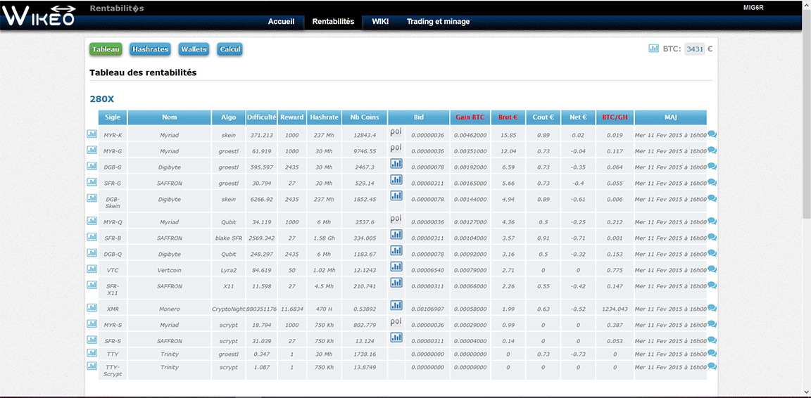

# Bitcoin and Cryptos interface Profitabily

this is an application developed in 2014 when I was mining cryptocurrency.
I let you judge very particular coding style, but this application has helped me a lot to stay profitable in my mining. 
Initially it was a project-oriented discussion area for mastering work that I had created for my company.

## Demo

## Install

Find the bdd in database folder.
>user : admin

>pass : admin

## Usage

* Differents algorythm hashrate for graphique cards 
* Markets graphics prices
* Discussion areas with file upload
* Api for more profitable crypto
* Users / graphics cards / cryptos management

## Copyright

This project is licensed under the MIT License - see the [license](LICENSE) file for details.